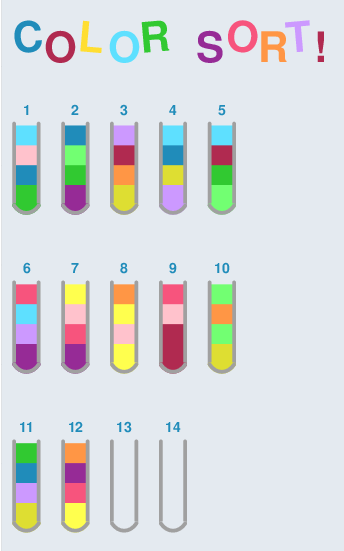
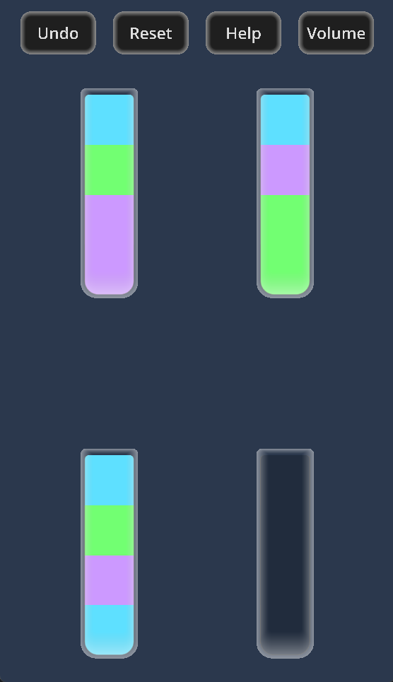

# COLOR SORT!
A series of ongoing projects to learn mobile app, video game, and web development through implementation of the puzzle game Color Sort 

[Unfamiliar with Color Sort? Click here for more information](#what-is-color-sort) 

Developed by Shanna Wallace, unless otherwise noted.  
Updated: 6/25/2024

## Project Contents:
### [c++](https://github.com/shannaw04/color_sort/tree/main/c%2B%2B): 
* Basic version of Color Sort written in C++ 
* Takes input from command line and prints the game display in ASCII art, using letters to represent colors
* Level generator program to create random levels 

### [Jgraph](https://github.com/shannaw04/color_sort_jgraph/tree/fe5ff2453d1089a2ee664c1dc28ccedf509386b4): 
* Uses [Dr. James Plank's Jgraph program](https://web.eecs.utk.edu/~jplank/plank/jgraph/jgraph.html) to create a colorful jpg of the game board after each move 

### [Godot](https://github.com/cs340-24/color_sort/tree/e36a80262ff33a3144d8b7034370c7072463be76): 
* Managed a group project to create a Color Sort mobile app with classmates at UTK 
* Built using Godot Engine and GDScript
* Game runs correctly on Godot's emulator. APK will launch welcome screen on Android devices, but fails to load level data
* Features:
   * Welcome screen
   * Background music & sound effects: [(Landon Boone)](https://github.com/landon-boone2001)
   * Animations: [(Logan Lett)](https://github.com/10-Squares)
   * Help screen with gameplay instructions: [(Logan Lett)](https://github.com/10-Squares)
   * Ability to reset levels
   * Ability to undo moves: [(Coleman Oates)](https://github.com/coates4)
   * Challenge mode that masks some colors for added difficulty  

### [Kotlin]():
* Developing an Android Color Sort app using Android Studio and Kotlin

## Future Plans / Works in Progress:
* Create Color Sort web page that will run the game and display the Jgraph-generated jpg after each move
* Functional APK of Godot version
* Fully operational Android and iOS Color Sort mobile app
* Add ability to save and reload game progress
* Add option to select difficulty level
* Create a tutorial level
* Improvements to level generator

## What is Color Sort?
Color Sort is a puzzle game that starts with blocks of various colors shuffled up in bottles.  

The objective of the game is to sort all of the colors so that all blocks of the same color are in the same bottle. 

You will be given 1 empty bottle to start with if there are 2 or 3 colors to be sorted and 2 empty bottles if there are 4 or more colors.

## How to Play:
You can move the top-most color from one bottle to another bottle if: 
* The source bottle is not empty
* The destination bottle is empty 
* The destination bottle is not empty, but has empty space available and the top color matches the top color in the source bottle.
* Neither bottle has already been sorted (full of blocks of only one color)  

Once all colors have been sorted so that all blocks of the same color are in the same bottle, the level is complete! 
